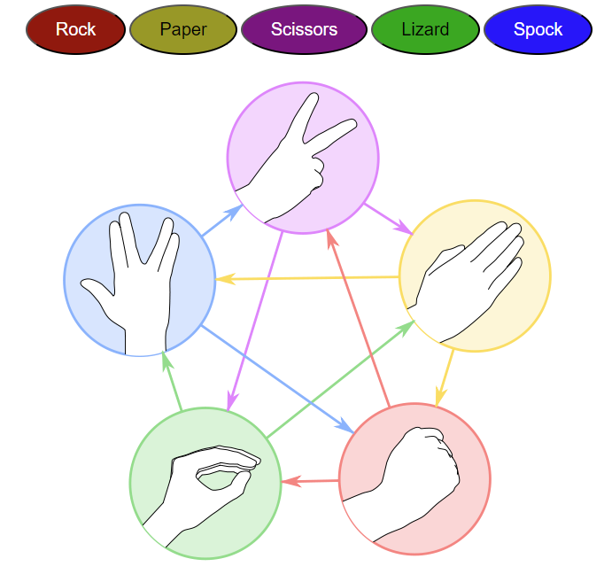
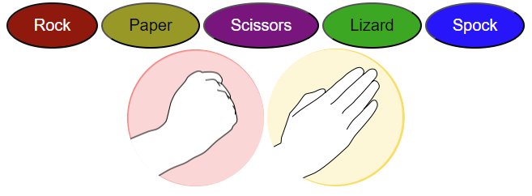

# Rock, Paper, Scissors, Lizard, Spock
Rock, Paper, Scissors, Lizard, Spock is a site that allows users to play a fully responsive game of the same name. The game is played against the computer, the player chooses one of the options and the computer makes its own choice and a winner is decided.

## Features

### Existing Features

#### Heading

The heading displayed at the top of the page stands out and immediately lets the user know the game they are playing.

#### Game Area

This section allows the user to make their choice of either rock, paper, scissors, lizard or spock. This achieved by clicking on one of the buttons representing each choice.
It also includes a diagram showing all of the matchups and who wins them.
The diagram changes to individual images of the player and computers choice.

#### Score Area

This section shows the player the scores of themselves and the computer, allowing them to keep track of how many games they have won or lost.

#### Rules
This footer clearly shows the rules for the game.

## Testing
All buttons have been tested and are working as expected.
The message that displays informing the player of who won and the score counter also function as expected.

The site also functions properly on screens of all sizes.

### Validator Testing

#### HTML
All code passes through the W3C validator.

#### CSS
All code passes through the W3C validator.

#### Javascript
All code passes the jshint validator.
The following metrics were returned:

There are 10 functions in this file.

Function with the largest signature take 1 arguments, while the median is 0.

Largest function has 17 statements in it, while the median is 12.5.

The most complex function has a cyclomatic complexity value of 6 while the median is 6.

## Deployment
The site was deployed to GitHub pages. The steps to deploy are as follows:
In the GitHub repository, navigate to the Settings tab
From the source section drop-down menu, select the Master Branch
Once the master branch has been selected, the page will be automatically refreshed with a detailed ribbon display to indicate the successful deployment.

The live link can be found here - https://github.com/TylerMorgan142/Rock-Paper-Scissors-Lizard-Spock/settings/pages

## Credits

### Content

The text for the rules in the footer was taken from https://bigbangtheory.fandom.com/wiki/Rock,_Paper,_Scissors,_Lizard,_Spock

### Media
The images used are taken from https://bigbangtheory.fandom.com/wiki/Rock,_Paper,_Scissors,_Lizard,_Spock